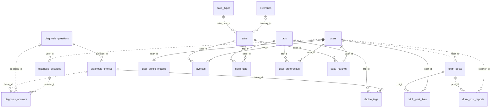

# 一升の出会い DB設計書

作成日：2026年10月3日　実DB確認日：2026年10月5日

## 1. 対象と前提

本書は NewBooze（日本酒紹介・好み診断アプリ）の現行DB構造を示す設計書です。2026年10月5日に指定のphpMyAdminへログインし、`issho_no_deai` と `newbooze` の全18テーブルのCREATE定義を確認しました。主な対象はローカル接続設定が指す `issho_no_deai` です。カラム・型・初期値・主キー・一意制約・索引・外部キー・削除規則・CHECK制約を実DBに照合し、保存ルールはアプリ実装を併せて参照しています。

- 確認サーバー：127.0.0.1、MariaDB 10.11.19（Homebrew）。phpMyAdmin 5.2.3。
- ローカル接続設定：`issho_no_deai`。既定設定：`newbooze`。両DBとも存在します。起動中プロセスの接続先までは本調査で確認していません。
- ストレージエンジン：InnoDB。文字コード：utf8mb4。照合順序：utf8mb4_unicode_ci。
- 接続URLの時刻指定：Asia/Tokyo。DBのセッション・グローバルタイムゾーンは未取得のため、接続時に統一して運用します。
- 全18テーブル、外部キー23本。単独の `id` は BIGINT(20) UNSIGNED・自動採番。中間テーブルは複合主キーを使用します。
- 調査では構造の参照のみを行いました。DBの定義・保存データは変更していません。

## 2. テーブル一覧

| テーブル | 役割 |
|---|---|
| `users` | ユーザー情報と認証 |
| `breweries` | 酒蔵マスタ |
| `sake_types` | 酒種マスタ |
| `tags` | 味わい・香りのタグマスタ |
| `diagnosis_questions` | 好み診断の設問 |
| `sake` | 日本酒カタログ |
| `diagnosis_choices` | 設問ごとの選択肢 |
| `diagnosis_sessions` | ユーザーの診断実施履歴 |
| `drink_posts` | 飲酒投稿 |
| `user_profile_images` | ユーザーのプロフィール画像と表示位置 |
| `choice_tags` | 選択肢とタグの対応・加点重み |
| `diagnosis_answers` | 診断ごとの回答履歴 |
| `drink_post_likes` | 投稿へのいいね |
| `drink_post_reports` | 投稿への通報 |
| `favorites` | 日本酒のお気に入り |
| `sake_tags` | 日本酒とタグの対応・特徴スコア |
| `user_preferences` | ユーザーのタグ別嗜好スコア |
| `sake_reviews` | 日本酒の評価・レビューと公開設定 |

## 3. ER図

実線は識別関係（子の主キーに親のキーを含む）、点線は非識別関係です。任意の酒蔵・プロフィール画像を含めて、多重度を示しています。

## 4. テーブル定義

「必須」は NOT NULL を示します。PK＝主キー、FK＝外部キー。型は実DBの表示に合わせています。BIGINT(20)・INT(11)等の括弧内は表示幅で、桁数制限ではありません。真偽値項目はTINYINT(1)で保持します。デフォルトなしの必須項目は登録時に値を指定します。

### 4.1 `users` — ユーザー情報と認証

| カラム | 型 | 必須 | 初期値・自動設定 | キー |
|---|---|---|---|---|
| `id` | BIGINT(20) UNSIGNED | ○ | 自動採番 | PK |
| `name` | VARCHAR(50) | ○ | — | — |
| `email` | VARCHAR(255) | ○ | — | — |
| `password_hash` | VARCHAR(255) | ○ | — | — |
| `temporary_password` | TINYINT(1) | ○ | 0 | — |
| `created_at` | DATETIME | ○ | CURRENT_TIMESTAMP | — |
| `admin` | TINYINT(1) | ○ | 0 | — |

一意制約・索引・値制約：

- `UNIQUE KEY uk_users_email (email)`

### 4.2 `breweries` — 酒蔵マスタ

| カラム | 型 | 必須 | 初期値・自動設定 | キー |
|---|---|---|---|---|
| `id` | BIGINT(20) UNSIGNED | ○ | 自動採番 | PK |
| `name` | VARCHAR(100) | ○ | — | — |
| `prefecture` | VARCHAR(50) | — | NULL | — |

一意制約・索引・値制約：

- `UNIQUE KEY uk_breweries_name (name)`

### 4.3 `sake_types` — 酒種マスタ

| カラム | 型 | 必須 | 初期値・自動設定 | キー |
|---|---|---|---|---|
| `id` | BIGINT(20) UNSIGNED | ○ | 自動採番 | PK |
| `name` | VARCHAR(50) | ○ | — | — |

一意制約・索引・値制約：

- `UNIQUE KEY uk_sake_types_name (name)`

### 4.4 `tags` — 味わい・香りのタグマスタ

| カラム | 型 | 必須 | 初期値・自動設定 | キー |
|---|---|---|---|---|
| `id` | BIGINT(20) UNSIGNED | ○ | 自動採番 | PK |
| `name` | VARCHAR(50) | ○ | — | — |
| `category` | VARCHAR(30) | ○ | — | — |

一意制約・索引・値制約：

- `UNIQUE KEY uk_tags_name (name)`

### 4.5 `diagnosis_questions` — 好み診断の設問

| カラム | 型 | 必須 | 初期値・自動設定 | キー |
|---|---|---|---|---|
| `id` | BIGINT(20) UNSIGNED | ○ | 自動採番 | PK |
| `question_text` | VARCHAR(255) | ○ | — | — |
| `sort_order` | INT(11) | ○ | 0 | — |

一意制約・索引・値制約：

- `UNIQUE KEY uk_diagnosis_questions_text (question_text)`
- `UNIQUE KEY uk_diagnosis_questions_sort (sort_order)`

### 4.6 `sake` — 日本酒カタログ

| カラム | 型 | 必須 | 初期値・自動設定 | キー |
|---|---|---|---|---|
| `id` | BIGINT(20) UNSIGNED | ○ | 自動採番 | PK |
| `brewery_id` | BIGINT(20) UNSIGNED | — | NULL | FK → breweries.id |
| `sake_type_id` | BIGINT(20) UNSIGNED | ○ | — | FK → sake_types.id |
| `name` | VARCHAR(100) | ○ | — | — |
| `region` | VARCHAR(50) | — | NULL | — |
| `abv` | DECIMAL(4,1) | — | NULL | — |
| `price` | INT(10) UNSIGNED | — | NULL | — |
| `description` | TEXT | — | NULL | — |
| `image_url` | VARCHAR(255) | — | NULL | — |
| `created_at` | DATETIME | ○ | CURRENT_TIMESTAMP | — |

一意制約・索引・値制約：

- `UNIQUE KEY uk_sake_name (name)`
- `KEY idx_sake_brewery (brewery_id)`
- `KEY idx_sake_type (sake_type_id)`

親レコード削除時：

- `breweries.id`（`brewery_id`）：参照カラムをNULLに変更。
- `sake_types.id`（`sake_type_id`）：参照中は親レコードの削除を拒否。

### 4.7 `diagnosis_choices` — 設問ごとの選択肢

| カラム | 型 | 必須 | 初期値・自動設定 | キー |
|---|---|---|---|---|
| `id` | BIGINT(20) UNSIGNED | ○ | 自動採番 | PK |
| `question_id` | BIGINT(20) UNSIGNED | ○ | — | FK → diagnosis_questions.id |
| `choice_text` | VARCHAR(255) | ○ | — | — |

一意制約・索引・値制約：

- `UNIQUE KEY uk_diagnosis_choice (question_id, choice_text)`

親レコード削除時：

- `diagnosis_questions.id`（`question_id`）：子レコードも削除。

### 4.8 `diagnosis_sessions` — ユーザーの診断実施履歴

| カラム | 型 | 必須 | 初期値・自動設定 | キー |
|---|---|---|---|---|
| `id` | BIGINT(20) UNSIGNED | ○ | 自動採番 | PK |
| `user_id` | BIGINT(20) UNSIGNED | ○ | — | FK → users.id |
| `taken_at` | DATETIME | ○ | CURRENT_TIMESTAMP | — |

一意制約・索引・値制約：

- `KEY idx_diagnosis_sessions_user (user_id)`

親レコード削除時：

- `users.id`（`user_id`）：子レコードも削除。

### 4.9 `drink_posts` — 飲酒投稿

| カラム | 型 | 必須 | 初期値・自動設定 | キー |
|---|---|---|---|---|
| `id` | BIGINT(20) UNSIGNED | ○ | 自動採番 | PK |
| `user_id` | BIGINT(20) UNSIGNED | ○ | — | FK → users.id |
| `sake_name` | VARCHAR(100) | ○ | — | — |
| `comment` | VARCHAR(500) | — | NULL | — |
| `created_at` | DATETIME | ○ | CURRENT_TIMESTAMP | — |

一意制約・索引・値制約：

- `KEY idx_drink_posts_user (user_id)`

親レコード削除時：

- `users.id`（`user_id`）：子レコードも削除。

### 4.10 `user_profile_images` — ユーザーのプロフィール画像と表示位置

| カラム | 型 | 必須 | 初期値・自動設定 | キー |
|---|---|---|---|---|
| `user_id` | BIGINT(20) UNSIGNED | ○ | — | PK, FK → users.id |
| `image_data` | MEDIUMBLOB | ○ | — | — |
| `content_type` | VARCHAR(50) | ○ | — | — |
| `updated_at` | DATETIME | ○ | CURRENT_TIMESTAMP / 更新時に現在時刻 | — |
| `position_x` | INT(11) | ○ | 50 | — |
| `position_y` | INT(11) | ○ | 50 | — |
| `zoom` | INT(11) | ○ | 100 | — |

親レコード削除時：

- `users.id`（`user_id`）：子レコードも削除。

### 4.11 `choice_tags` — 選択肢とタグの対応・加点重み

| カラム | 型 | 必須 | 初期値・自動設定 | キー |
|---|---|---|---|---|
| `choice_id` | BIGINT(20) UNSIGNED | ○ | — | PK, FK → diagnosis_choices.id |
| `tag_id` | BIGINT(20) UNSIGNED | ○ | — | PK, FK → tags.id |
| `weight` | TINYINT(3) UNSIGNED | ○ | 1 | — |

一意制約・索引・値制約：

- `KEY idx_choice_tags_tag (tag_id)`

親レコード削除時：

- `diagnosis_choices.id`（`choice_id`）：子レコードも削除。
- `tags.id`（`tag_id`）：子レコードも削除。

### 4.12 `diagnosis_answers` — 診断ごとの回答履歴

| カラム | 型 | 必須 | 初期値・自動設定 | キー |
|---|---|---|---|---|
| `id` | BIGINT(20) UNSIGNED | ○ | 自動採番 | PK |
| `session_id` | BIGINT(20) UNSIGNED | ○ | — | FK → diagnosis_sessions.id |
| `question_id` | BIGINT(20) UNSIGNED | ○ | — | FK → diagnosis_questions.id |
| `choice_id` | BIGINT(20) UNSIGNED | ○ | — | FK → diagnosis_choices.id |

一意制約・索引・値制約：

- `UNIQUE KEY uk_diagnosis_answer_session_question (session_id, question_id)`
- `KEY idx_diagnosis_answers_question (question_id)`
- `KEY idx_diagnosis_answers_choice (choice_id)`

親レコード削除時：

- `diagnosis_sessions.id`（`session_id`）：子レコードも削除。
- `diagnosis_questions.id`（`question_id`）：参照中は親レコードの削除を拒否。
- `diagnosis_choices.id`（`choice_id`）：参照中は親レコードの削除を拒否。

### 4.13 `drink_post_likes` — 投稿へのいいね

| カラム | 型 | 必須 | 初期値・自動設定 | キー |
|---|---|---|---|---|
| `user_id` | BIGINT(20) UNSIGNED | ○ | — | PK, FK → users.id |
| `post_id` | BIGINT(20) UNSIGNED | ○ | — | PK, FK → drink_posts.id |
| `created_at` | DATETIME | ○ | CURRENT_TIMESTAMP | — |

一意制約・索引・値制約：

- `KEY idx_drink_post_likes_post (post_id)`

親レコード削除時：

- `users.id`（`user_id`）：子レコードも削除。
- `drink_posts.id`（`post_id`）：子レコードも削除。

### 4.14 `drink_post_reports` — 投稿への通報

| カラム | 型 | 必須 | 初期値・自動設定 | キー |
|---|---|---|---|---|
| `id` | BIGINT(20) UNSIGNED | ○ | 自動採番 | PK |
| `reporter_id` | BIGINT(20) UNSIGNED | ○ | — | FK → users.id |
| `post_id` | BIGINT(20) UNSIGNED | ○ | — | FK → drink_posts.id |
| `reason` | VARCHAR(30) | ○ | — | — |
| `created_at` | DATETIME | ○ | CURRENT_TIMESTAMP | — |

一意制約・索引・値制約：

- `UNIQUE KEY uk_drink_post_reporter (reporter_id, post_id)`
- `KEY idx_drink_post_reports_post (post_id)`

親レコード削除時：

- `users.id`（`reporter_id`）：子レコードも削除。
- `drink_posts.id`（`post_id`）：子レコードも削除。

### 4.15 `favorites` — 日本酒のお気に入り

| カラム | 型 | 必須 | 初期値・自動設定 | キー |
|---|---|---|---|---|
| `user_id` | BIGINT(20) UNSIGNED | ○ | — | PK, FK → users.id |
| `sake_id` | BIGINT(20) UNSIGNED | ○ | — | PK, FK → sake.id |
| `created_at` | DATETIME | ○ | CURRENT_TIMESTAMP | — |

一意制約・索引・値制約：

- `KEY idx_favorites_sake (sake_id)`

親レコード削除時：

- `users.id`（`user_id`）：子レコードも削除。
- `sake.id`（`sake_id`）：子レコードも削除。

### 4.16 `sake_tags` — 日本酒とタグの対応・特徴スコア

| カラム | 型 | 必須 | 初期値・自動設定 | キー |
|---|---|---|---|---|
| `sake_id` | BIGINT(20) UNSIGNED | ○ | — | PK, FK → sake.id |
| `tag_id` | BIGINT(20) UNSIGNED | ○ | — | PK, FK → tags.id |
| `score` | TINYINT(3) UNSIGNED | ○ | 3 | — |

一意制約・索引・値制約：

- `KEY idx_sake_tags_tag (tag_id)`

親レコード削除時：

- `sake.id`（`sake_id`）：子レコードも削除。
- `tags.id`（`tag_id`）：子レコードも削除。

### 4.17 `user_preferences` — ユーザーのタグ別嗜好スコア

| カラム | 型 | 必須 | 初期値・自動設定 | キー |
|---|---|---|---|---|
| `user_id` | BIGINT(20) UNSIGNED | ○ | — | PK, FK → users.id |
| `tag_id` | BIGINT(20) UNSIGNED | ○ | — | PK, FK → tags.id |
| `score` | INT(11) | ○ | 0 | — |

一意制約・索引・値制約：

- `KEY idx_user_preferences_tag (tag_id)`

親レコード削除時：

- `users.id`（`user_id`）：子レコードも削除。
- `tags.id`（`tag_id`）：子レコードも削除。

### 4.18 `sake_reviews` — 日本酒の評価・レビューと公開設定

| カラム | 型 | 必須 | 初期値・自動設定 | キー |
|---|---|---|---|---|
| `user_id` | BIGINT(20) UNSIGNED | ○ | — | PK, FK → users.id |
| `sake_id` | BIGINT(20) UNSIGNED | ○ | — | PK, FK → sake.id |
| `published` | TINYINT(1) | ○ | 0 | — |
| `rating` | TINYINT(3) UNSIGNED | ○ | — | — |
| `comment` | VARCHAR(500) | ○ | '' | — |
| `updated_at` | TIMESTAMP | ○ | CURRENT_TIMESTAMP / 更新時に現在時刻 | — |

一意制約・索引・値制約：

- `KEY idx_reviews_public (sake_id, published, updated_at, user_id)`
- `CONSTRAINT chk_sake_reviews_rating CHECK (rating BETWEEN 1 AND 5)`

親レコード削除時：

- `users.id`（`user_id`）：子レコードも削除。
- `sake.id`（`sake_id`）：子レコードも削除。

## 5. 機能と保存ルール

- 管理者権限：`users.admin` を真偽値として管理します。初期値0は一般ユーザー、1は管理者です。
- 会員登録：メールアドレスは一意。パスワードは `password_hash` にハッシュを保存し、仮パスワード状態は `temporary_password` で管理します。
- 日本酒検索：`sake` を中心に酒蔵・酒種・タグを参照します。酒蔵は未設定を許容します。
- 診断：設問 → 選択肢 → タグの重みを集計します。ログイン中の回答は `diagnosis_sessions` と `diagnosis_answers` に保存します。未ログイン時は診断結果をDB保存しません。
- 回答：1回の診断につき同じ設問の回答は1件。選択肢の所属設問との一致はサービスが選択肢から設問を取得して保証しており、現行FKだけでは一致を保証しません。
- 嗜好：集計対象タグの `user_preferences.score` を上書きします。今回の集計に含まれない過去のタグ行は現行実装では残ります。履歴そのものは回答テーブルに保持します。
- お気に入り・いいね：複合主キーで同一ユーザーによる同一対象の重複登録を防止します。
- 通報：同一投稿への同一ユーザーの通報は1件。理由は文字列で保持します。
- レビュー：1ユーザー・1商品につき1件。再登録は更新。評価は1〜5、`published` の初期値は非公開。公開一覧・平均評価は公開レビューのみを集計します。
- 飲酒投稿：商品IDではなく `sake_name` を保存します。カタログ未登録の日本酒についても投稿でき、商品削除や名称変更の影響を受けません。
- プロフィール画像：1ユーザーにつき最大1件。画像本体・MIMEタイプ・表示位置・拡大率を保存します。

## 6. 設計上の注意と改善候補

以下は現行定義に含まれない改善案です。適用する場合は別途マイグレーションと実装変更が必要です。

| 項目 | 現状 | 改善候補 |
|---|---|---|
| 回答の整合性 | 設問と選択肢を個別のFKで参照 | 選択肢側に `(question_id, id)` の一意キーを設け、回答側から複合FKで参照する |
| 嗜好の更新 | 集計に含まれない古いタグのスコアが残る | 最新診断だけを表すなら、トランザクション内で旧嗜好を削除して今回分に置換する |
| 数値の範囲 | 評価のみCHECKあり | 運用範囲を決定後、度数・タグ重み・画像位置・拡大率にも制約を設ける |
| 診断履歴の保持 | 使用済み設問・選択肢はFKにより削除が制限される | 設問を無効化するフラグや版管理を追加し、回答履歴を維持する |
| 商品の識別 | 商品名が全体で一意 | 同名商品を扱う場合は商品コードなどを導入し、名称の一意制約を見直す |
| 一覧性能 | 投稿・診断履歴はユーザーIDの索引のみ | 実際の件数とクエリ計画に応じて `(user_id, created_at, id)` 等を追加する |
| タイムスタンプ | DATETIMEとTIMESTAMPが混在 | 接続タイムゾーンを統一し、必要に応じて保存方式を統一する |

## 7. 作成SQLと運用

新規DB作成用SQLは [create_issho_no_deai.sql](../data/create_issho_no_deai.sql)、手順は [RESET_DATABASE.md](../data/RESET_DATABASE.md) を参照してください。作成SQLには全18テーブルと日本酒10件、診断4問・選択肢12件、酒種・タグの初期データが含まれます。ユーザーや投稿・レビューの初期データはありません。酒蔵マスタは空です。

`CREATE DATABASE` は同名DBがある場合に失敗します。既存DBの削除・変更はせず、未使用DB名で実行します。旧DB向けの差分SQLは型や照合順序が異なるため、本書の新規作成SQLと混在させないでください。アプリは `ddl-auto=validate` を使用し、起動時にエンティティとDB定義の整合性を検証します。

## 8. 実DB照合結果

調査先は指定された `http://localhost:8081/phpmyadmin/index.php` です。両DBの「構造」画面と「作成を表示する」で全テーブルの定義を確認しました。認証情報・メールアドレス・パスワードハッシュ等の実レコードは設計書に含めません。

- `issho_no_deai` と `newbooze` はともに18テーブルです。CREATE定義は、テーブルごとのAUTO_INCREMENT現在値を除いて一致しました。データ内容は別です。
- 前版に不足していた `users.admin` を追加しました。実DBでは `created_at` の後に配置されています。現在の作成SQLでは `password_hash` の後に配置されており、列順が異なります。
- `sake_reviews.published` の実型はTINYINT(1)、初期値は0です。SQLのBOOLEAN・FALSEと同等の真偽値表現です。
- 全23本の外部キー、主キー・一意キー・索引、レビュー評価の1〜5 CHECKを確認しました。前版の関係図と削除規則に変更はありません。
- 構造画面の表示行数は `issho_no_deai` が合計87行、`newbooze` が合計120行でした。InnoDBの表示行数は推定値であり、厳密なCOUNT集計ではありません。
- `issho_no_deai` の構造画面では日本酒10行、酒種7行、タグ7行、設問4行、選択肢12行、酒蔵0行と表示されています。マスタの定義は確認済みですが、各商品の名称や価格等の全レコード内容は今回の構造調査の対象外です。

今後の定義変更時は、この設計書と新規作成SQL・差分SQLを同時に更新します。第6章の改善候補は提案であり、実DBには適用していません。
